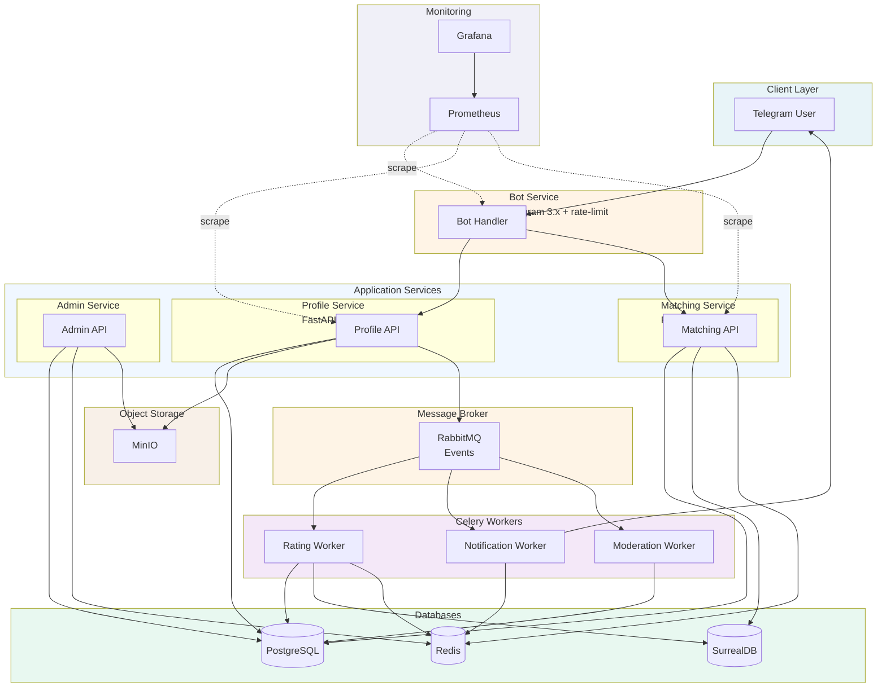
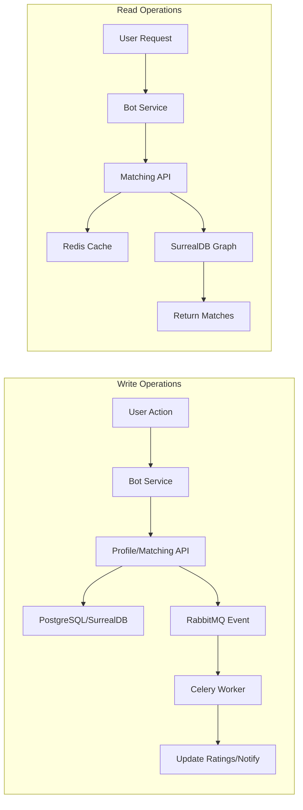
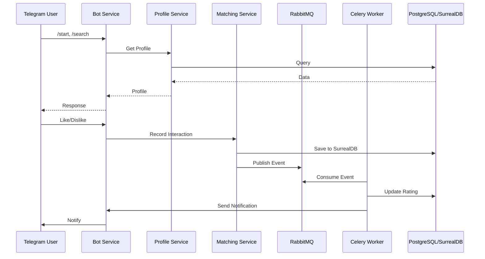

# Dating Bot Architecture

## System Overview

```mermaid
flowchart TB
    subgraph Client["Client Layer"]
        TG[Telegram User]
    end

    subgraph Bot["Bot Service<br/>aiogram 3.x + rate-limit"]
        BOT[Bot Handler]
    end

    subgraph Services["Application Services"]
        subgraph Profile["Profile Service<br/>FastAPI"]
            PROF[Profile API]
        end
        subgraph Matching["Matching Service<br/>FastAPI"]
            MATCH[Matching API]
        end
        subgraph Admin["Admin Service<br/>FastAPI"]
            ADMIN[Admin API]
        end
    end

    subgraph MessageBroker["Message Broker"]
        RMQ[RabbitMQ<br/>Events]
    end

    subgraph Workers["Celery Workers"]
        RATING[Rating Worker]
        NOTIFY[Notification Worker]
        MOD[Moderation Worker]
    end

    subgraph Databases["Databases"]
        PG[(PostgreSQL)]
        SDB[(SurrealDB)]
        REDIS[(Redis)]
    end

    subgraph Storage["Object Storage"]
        MINIO[MinIO]
    end

    subgraph Monitoring["Monitoring"]
        PROM[Prometheus]
        GRAF[Grafana]
    end

    %% Client to Bot
    TG --> BOT

    %% Bot to Services
    BOT --> PROF
    BOT --> MATCH

    %% Services to Databases
    PROF --> PG
    PROF --> MINIO
    PROF --> RMQ

    MATCH --> PG
    MATCH --> SDB
    MATCH --> REDIS

    ADMIN --> PG
    ADMIN --> REDIS
    ADMIN --> MINIO

    %% Message Broker to Workers
    RMQ --> RATING
    RMQ --> NOTIFY
    RMQ --> MOD

    %% Workers to Databases
    RATING --> PG
    RATING --> SDB
    RATING --> REDIS

    NOTIFY --> REDIS
    NOTIFY --> TG

    MOD --> PG

    %% Monitoring
    PROM -.->|scrape| BOT
    PROM -.->|scrape| PROF
    PROM -.->|scrape| MATCH
    GRAF --> PROM

    %% Styling
    style Client fill:#e8f4f8
    style Bot fill:#fff4e6
    style Services fill:#f0f7ff
    style MessageBroker fill:#fef4e6
    style Workers fill:#f4e8f8
    style Databases fill:#e8f8f0
    style Storage fill:#f8f0e8
    style Monitoring fill:#f0f0f8
```

## Data Flow

```mermaid
flowchart LR
    subgraph Write["Write Operations"]
        W1[User Action] --> W2[Bot Service]
        W2 --> W3[Profile/Matching API]
        W3 --> W4[PostgreSQL/SurrealDB]
        W3 --> W5[RabbitMQ Event]
        W5 --> W6[Celery Worker]
        W6 --> W7[Update Ratings/Notify]
    end

    subgraph Read["Read Operations"]
        R1[User Request] --> R2[Bot Service]
        R2 --> R3[Matching API]
        R3 --> R4[Redis Cache]
        R3 --> R5[SurrealDB Graph]
        R5 --> R6[Return Matches]
    end
```

## Component Communication

```mermaid
sequenceDiagram
    participant U as Telegram User
    participant B as Bot Service
    participant P as Profile Service
    participant M as Matching Service
    participant RMQ as RabbitMQ
    participant W as Celery Worker
    participant DB as PostgreSQL/SurrealDB

    U->>B: /start, /search
    B->>P: Get Profile
    P->>DB: Query
    DB-->>P: Data
    P-->>B: Profile
    B-->>U: Response

    U->>B: Like/Dislike
    B->>M: Record Interaction
    M->>DB: Save to SurrealDB
    M->>RMQ: Publish Event
    W->>RMQ: Consume Event
    W->>DB: Update Rating
    W->>B: Send Notification
    B->>U: Notify
```
