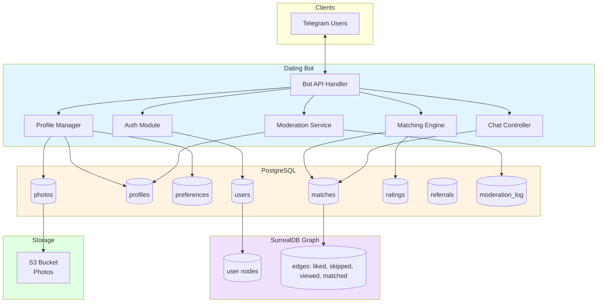

# Dating Bot Architecture

```mermaid
flowchart TB
    subgraph Clients["Clients"]
        TG[Telegram Users]
    end

    subgraph Bot["Dating Bot"]
        API[Bot API Handler]
        AUTH[Auth Module]
        PROF[Profile Manager]
        MATCH[Matching Engine]
        CHAT[Chat Controller]
        MOD[Moderation Service]
    end

    subgraph PostgreSQL["PostgreSQL"]
        USERS[(users)]
        PROFILES[(profiles)]
        PREFERENCES[(preferences)]
        PHOTOS[(photos)]
        MATCHES[(matches)]
        RATINGS[(ratings)]
        REFERRALS[(referrals)]
        MOD_LOG[(moderation_log)]
    end

    subgraph SurrealDB["SurrealDB Graph"]
        USER_NODES[(user nodes)]
        EDGES[(edges: liked, skipped, viewed, matched)]
    end

    subgraph Storage["Storage"]
        S3[S3 Bucket<br/>Photos]
    end

    TG <--> API
    API --> AUTH
    API --> PROF
    API --> MATCH
    API --> CHAT
    API --> MOD

    AUTH --> USERS
    PROF --> PROFILES
    PROF --> PREFERENCES
    PROF --> PHOTOS
    MATCH --> MATCHES
    MATCH --> RATINGS
    CHAT --> MATCHES
    MOD --> MOD_LOG
    MOD --> PROFILES

    USERS --> USER_NODES
    MATCHES --> EDGES
    PHOTOS --> S3

    style Bot fill:#e1f5ff
    style PostgreSQL fill:#fff4e1
    style SurrealDB fill:#f0e1ff
    style Storage fill:#e1ffe1
```
