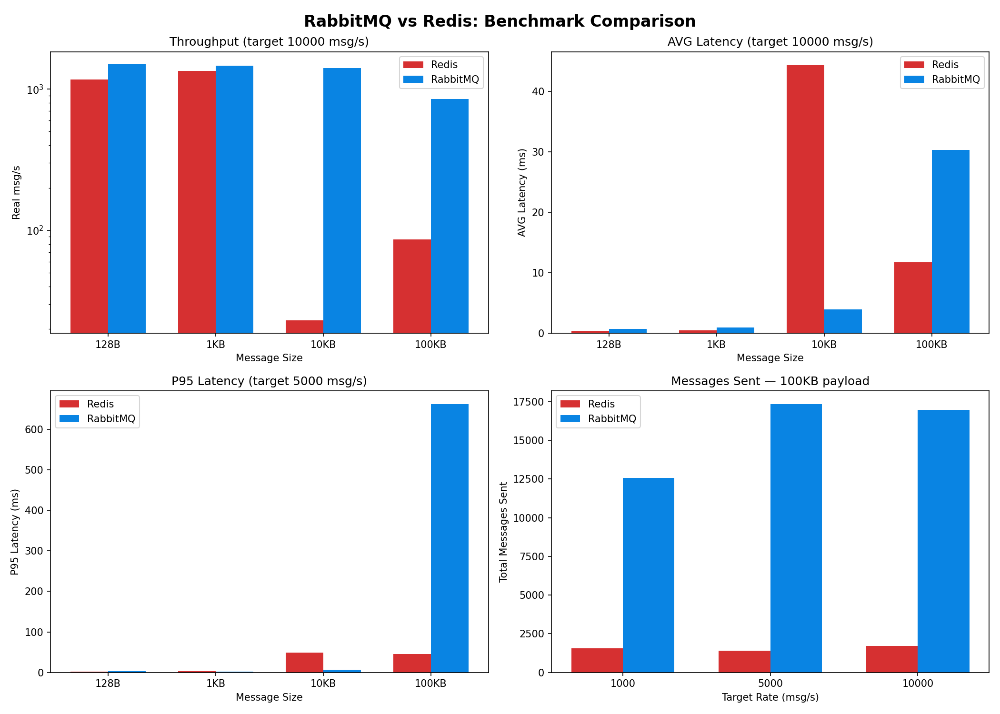

# Отчёт: сравнение RabbitMQ и Redis как брокеров сообщений

## Описание стенда

- **Producer**: Python-скрипт, генерирует JSON-сообщения с timestamp и payload заданного размера.
- **Consumer**: отдельный поток, читает сообщения и вычисляет latency.
- **Брокеры**: RabbitMQ 3 (management) и Redis 7, каждый ограничен 1 CPU / 512 MB RAM.
- **Длительность каждого теста**: 20 секунд.

## Параметры экспериментов

| Параметр | Значения |
|---|---|
| Размер сообщения | 128 B, 1 KB, 10 KB, 100 KB |
| Целевая интенсивность | 1 000, 5 000, 10 000 msg/s |
| Длительность | 20 с на каждый прогон |

## Результаты

### Сводная таблица

| BROKER | SIZE | TARGET | REAL | SENT | RECV | LOSS% | AVG ms | P95 ms | MAX ms | |
|---|---|---|---|---|---|---|---|---|---|---|
| redis | 128B | 1000 | 572 | 11446 | 11446 | 0.0 | 0.39 | 1.08 | 31.47 | |
| redis | 128B | 5000 | 1067 | 21346 | 21346 | 0.0 | 0.58 | 1.66 | 41.49 | |
| redis | 128B | 10000 | 1171 | 23420 | 23420 | 0.0 | 0.37 | 1.43 | 56.50 | |
| redis | 1KB | 1000 | 614 | 12284 | 12284 | 0.0 | 0.39 | 1.06 | 32.67 | |
| redis | 1KB | 5000 | 1089 | 21786 | 21786 | 0.0 | 0.67 | 2.46 | 35.76 | |
| redis | 1KB | 10000 | 1340 | 26791 | 26791 | 0.0 | 0.49 | 1.12 | 47.30 | |
| redis | 10KB | 1000 | 23 | 452 | 452 | 0.0 | 44.39 | 48.39 | 52.97 | |
| redis | 10KB | 5000 | 23 | 452 | 452 | 0.0 | 44.35 | 48.70 | 56.16 | |
| redis | 10KB | 10000 | 23 | 453 | 453 | 0.0 | 44.36 | 48.39 | 53.34 | |
| redis | 100KB | 1000 | 77 | 1546 | 1546 | 0.0 | 12.64 | 45.43 | 53.58 | |
| redis | 100KB | 5000 | 71 | 1417 | 1417 | 0.0 | 14.47 | 45.55 | 52.55 | |
| redis | 100KB | 10000 | 86 | 1713 | 1713 | 0.0 | 11.77 | 45.24 | 52.27 | |
| rabbitmq | 128B | 1000 | 617 | 12331 | 12331 | 0.0 | 0.67 | 2.02 | 43.48 | |
| rabbitmq | 128B | 5000 | 1388 | 27770 | 27770 | 0.0 | 1.15 | 3.08 | 57.39 | |
| rabbitmq | 128B | 10000 | 1495 | 29891 | 29891 | 0.0 | 0.75 | 1.82 | 41.74 | |
| rabbitmq | 1KB | 1000 | 605 | 12099 | 12099 | 0.0 | 0.62 | 1.62 | 45.72 | |
| rabbitmq | 1KB | 5000 | 1454 | 29073 | 29073 | 0.0 | 1.12 | 2.19 | 46.81 | |
| rabbitmq | 1KB | 10000 | 1465 | 29298 | 29298 | 0.0 | 0.99 | 2.74 | 48.17 | |
| rabbitmq | 10KB | 1000 | 611 | 12219 | 12219 | 0.0 | 6.57 | 11.61 | 43.04 | |
| rabbitmq | 10KB | 5000 | 1392 | 27841 | 27841 | 0.0 | 4.26 | 6.68 | 60.08 | |
| rabbitmq | 10KB | 10000 | 1413 | 28266 | 28266 | 0.0 | 3.95 | 6.03 | 70.67 | |
| rabbitmq | 100KB | 1000 | 629 | 12574 | 12574 | 0.0 | 2.71 | 14.81 | 51.80 | |
| rabbitmq | 100KB | 5000 | 867 | 17338 | 17338 | 0.0 | 155.31 | 662.19 | 744.87 | деградация |
| rabbitmq | 100KB | 10000 | 849 | 16985 | 16985 | 0.0 | 30.34 | 144.31 | 207.51 | деградация |

### Графики

## Наблюдения

### Redis — аномалия на 10 KB

Redis при размере сообщения 10 KB показывает резкое падение throughput: всего **23 msg/s** (452 сообщения за 20 с) при любом целевом rate. При этом на 100 KB работает лучше (~77-86 msg/s). Это неожиданное поведение, которое может быть связано с особенностями сериализации или throttling-логики на конкретной системе.

### RabbitMQ — стабильность до определённого порога

RabbitMQ показывает стабильную работу на размерах до 10 KB включительно, пропуская 1400+ msg/s при target 10000. Однако при 100 KB и интенсивности ≥5000 msg/s начинается явная деградация: p95 latency вырастает до **662 мс** (при 5000 msg/s) и **144 мс** (при 10000 msg/s).

## Выводы

### 1. Какой брокер показал большую пропускную способность

**RabbitMQ** показал значительно большую пропускную способность на малых и средних сообщениях (128 B — 10 KB). При target 10000 msg/s:
- 128 B: RabbitMQ — 1495 msg/s vs Redis — 1171 msg/s
- 1 KB: RabbitMQ — 1465 msg/s vs Redis — 1340 msg/s
- 10 KB: RabbitMQ — 1413 msg/s vs Redis — 23 msg/s (аномалия)

На 100 KB при 1000 msg/s RabbitMQ также впереди (629 vs 77 msg/s), но при повышении нагрузки начинает деградировать.

### 2. Какой брокер лучше переносит увеличение размера сообщения

**RabbitMQ** лучше переносит увеличение payload. Его throughput снижается плавно: 1495 → 1465 → 1413 → 849 msg/s при росте размера от 128 B до 100 KB (target 10000).

**Redis** демонстрирует аномальное поведение: проваливается на 10 KB (23 msg/s), но при этом на 100 KB показывает 86 msg/s. Latency Redis на 10 KB и 100 KB значительно выше (44-48 мс), чем на мелких сообщениях (<1 мс).

### 3. При какой нагрузке single instance начинает деградировать

- **Redis**: деградация начинается уже при **10 KB** — throughput падает до 23 msg/s, avg latency вырастает до 44 мс. На 100 KB throughput ограничен ~77-86 msg/s, но потерь нет.
- **RabbitMQ**: деградация начинается при **100 KB / 5000 msg/s** — p95 latency вырастает до 662 мс (при target 5000). При target 10000 p95 = 144 мс. Потерь сообщений нет, но latency неприемлемо высокий.

### 4. Какой инструмент лучше подходит для данного сценария и почему

**RabbitMQ** лучше подходит для сценария с переменным размером сообщений до 10 KB — стабильный throughput, предсказуемая latency, нет потерь. Преимущества: встроенная маршрутизация, exchanges, dead letter queues, управление через management UI.

**Redis** подходит для простых очередей с маленькими сообщениями (128 B — 1 KB), где важна минимальная latency (<1 мс). Однако показал неожиданную деградацию на средних размерах (10 KB), что требует дополнительного исследования.

Для продакшен-сценариев с крупными сообщениями оба брокера требуют тюнинга: RabbitMQ — увеличение `frame_max` и prefetch, Redis — настройка `maxmemory-policy` и использование Redis Streams вместо списков.
